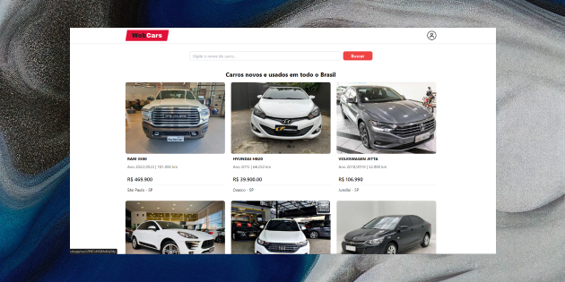

# Webcars site

Um site focado na venda e troca de veículos novos ou usados, baseado na dinâmica do famoso OLX, aonde o usuário faz um anúncio e negocia com outros usuários diretamente.

Foi criada uma interface simples e fácil de ser usada, para que pudesse atender o público globalmente de uma forma confortável.

# 🧠 Funcionalidades

O projeto tem todas funcionalidades para facilitar a venda e troca de veículos, dentre as funcionalidades do site temos:

- ✔️ registro de usuário
- ✔️ login de usuário
- ✔️ cadastro de veículos
- ✔️ excluir veículos
- ✔️ encaminhamento de mensagem para o whatsapp
- ✔️ Ver informações dos veículos
- ✔️ Filtro de busca
- ✔️ Privatização de rotas

## 🖥️ Tecnologias Utilizadas

- React.JS - Framework para interfaces de usuário
- Vite.JS - Build tool para organizar projeto
- Typescript - Superset de Javascript
- TailwindCSS - Estilização
- Firebase - Banco de dados
- React-router-dom - Biblioteca para roteamento de páginas
- Git - Versionamento de códigos
- Figma - Design da interface do projeto

## Configuração do projeto ⚙️⚙️

- ESlint
- Prettier
